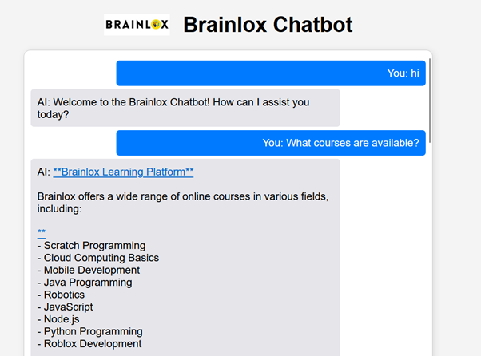
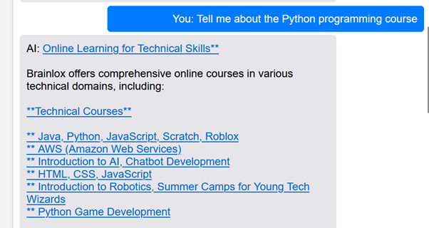

# Brainlox Chatbot

This is a custom chatbot that extracts data from Brainlox's technical courses page, creates embeddings, and provides a Flask API for conversation.

## Setup

1. Clone the repository:
   ```bash
   git clone https://github.com/Stv21/chatbot.git
   ```

2. Install the dependencies:
    ```bash
    pip install -r requirements.txt
    ```

3. Run the Flask API:
    ```bash 
    python app.py
    ```

## Screenshots




